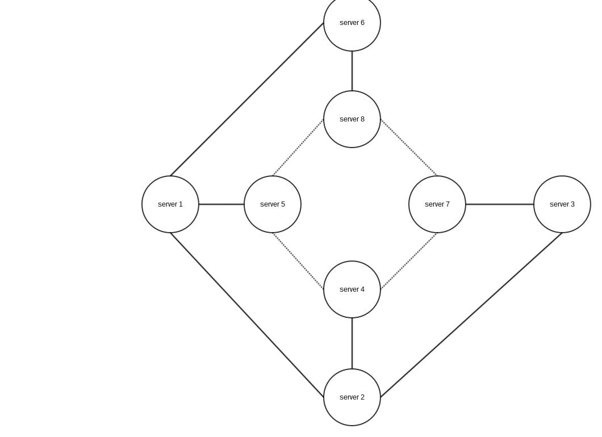

# Collection de données via Echo

## Pourquoi cet algorithme

Lors d'un ajout de serveur à notre réseau, nous prenons le risque de connecter deux réseaux entre eux. Si tel est le cas, il nous faut un moyen pour retrouver la liste des pseudos des personnes connectées, ainsi que la liste des serveurs connectés.

D'où le besoin de cet algorithme.

## principe

Le concept est qu'on va effectuer un écho pour collecter des données sur chacun des noeuds.

Chaque noeud chargera dans son message de broadcast ( envoyé à tous sauf à l'éventuel parent ) les informations qu'on lui demande de transmettre. 
Chaque noeud écoute les données des noeuds voisins et les accumule pour cet écho. 
Enfin, dès que chacun des noeuds lui a répondu ( il a reçu autant de messages qu'il y a de noeuds auquel il est relié ), 
il renvoie l'ensemble des données récoltées ( en faisant attention à d'imancables doublons ) à son parent si il n'est pas initiateur, 
sinon si il est initiateur, il a collecté l'ensemble des données des noeuds du réseau.

## Algorithme

	Init p = #p, seq = 0, rcvMsg[p][seq] = 0, waveData[p][seq] = [], father = null
	
	if initiateur
		seq ++
		set message p and seq
		broadcast message to all neightbours
	fsi
	tant que rcvMsg[p][seq] < #neightbours
		receive message from q
		Merge message.data and waveData[p][seq]
		if first time we spot this echo
			father = q
			repleice message.data by our node datas
			broadcast message to all neightbours except q
		rcvMsg[p][seq]++
	done
	if is Initiator
		return waveData[p][seq]
	else
		message.data = waveData[p][seq]
		send message to father
	fsi

## Exemple

Nous avons noeuds :

  - 1 : relié à 2 et 4   donnée : w waveData : []
  - 2 : relié à 1 4 et 3 donnée : x waveData : []
  - 3 : relié à 2 et 4   donnée : y waveData : []
  - 4 : relié à 1 2 et 4 donnée : z waveData : []

1 initie l'algorithme :

 - envoie à 2 un paquet avec comme donnée w
 - envoie à 4 un paquet avec comme donnée w

2 reçoit un message de 1 avec comme donnée w

 - waveData : [w]
 - father : 1
 - 2 envoie à 4 un paquet avec comme donnée x
 - 2 envoie à 3 un paquet avec comme donnée x

4 reçoit un message de 1 avec comme donnée w

 - waveData : [w]
 - father : 1
 - 4 envoie un paquet à 2 et 3 avec comme donnée z

4 reçoit un message de 2 avec comme donnée x

 - waveData : [w,x]

3 reçoit un paquet de 2 avec comme donnée x

 - waveData : [x]
 - father : 2
 - 3 envoie à 4 un paquet avec comme donnée y

2 reçoit un paquet de 4 avec comme donnée z

 - waveData : [w,x,z]

3 reçoit un paquet de 4 avec comme donnée z

 - waveData : [x,z]
 - 3 renvoie un paquet à 2 avec comme donnée [x,y,z]

4 reçoit un paquet de 3 avec comme donnée y

 - waveData : [w,x,y]
 - 4 renvoie [w,x,y,z] à 1

2 reçoit un message de 3 avec comme donnée [x,y,z]

 - waveData : [w,x,y,z]
 - 2 renvoie [w,x,y,z] à 1

1 reçoit [w,x,y,z] en provenance de 2 et 4

1 a maintenant connaissance des données du réseau. Il peut maintenant les diffuser aux autres noeuds.

## Complexité :

En O( N² ) où N est le nombre de serveurs.

## Preuve :

On a trivialement ( grâce au broadcast ) que chaque serveur reçoit le message. Il renverra donc l'information qu'il porte à son parent, qui le transmettra alors à son parent, et ainsi de suite.
Le noeud initiateur reçoit donc bien les données de tous les noeuds, ce qui est le but souhaité.

## Notes :

J'ai été assez tenté de me passer de la diffusion finale en ajoutant la chose suivante :

Quand on broadcast on envoie non plus l'information du noeud mais waveData.

Cet algorithme ne fonctionne pas ( j'ai trouvé un contre exemple ) : 

Les liens correspondent aux traits. Les lien plein correspondent aux relations père / fils, 
les traits en pointillés correspondent à des serveurs simplement liés.

En éxécutant ce qui est décrit ci-dessus, on montre que 4 n'aura pas les données de 8, et ainsi de suite